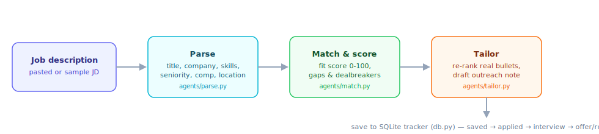

# Agentic Job-Search Assistant

**🔗 Live demo:** https://agentic-job-search-assistant.streamlit.app/

An agentic job-search assistant that parses job descriptions, scores fit against your profile, tailors your resume bullets, and drafts outreach notes. It is designed as a portfolio project that demonstrates parsing, matching, tailoring, embeddings, and a small FastAPI + Streamlit workflow.

## What it does

- Parses a job description into structured fields
- Scores how well your profile matches the role
- Tailors resume bullets to the job
- Drafts a short outreach note for the recruiter
- Stores progress in a simple SQLite tracker

## How it works



Try it in the [live demo](https://agentic-job-search-assistant.streamlit.app/) — it opens with a
sample JD pre-filled, so the full walkthrough below is one click away:

1. **Paste a job description** (or use the pre-filled sample) and click **Analyze**.
2. **Parse** ([app/agents/parse.py](app/agents/parse.py)) extracts the title, company, required
   and nice-to-have skills, seniority, compensation, and location from the raw JD text.
3. **Match** ([app/agents/match.py](app/agents/match.py)) scores fit 0–100 against
   [profile.json](profile.json) and surfaces missing must-haves or dealbreakers.
4. **Tailor** ([app/agents/tailor.py](app/agents/tailor.py)) re-ranks your *real* resume bullets
   by relevance to the JD and drafts a short outreach note — it never invents experience, only
   re-emphasizes what's already in your profile.
5. **Save to tracker** to log the role in the SQLite tracker and move it through
   `saved → applied → interview → offer/rejected` on the Tracker tab.

Everything above runs in dependency-free heuristic mode by default (no API key, no cost). Set
`LLM_PROVIDER` + the matching API key (see [Configuration](#configuration)) to swap in an LLM for
higher-quality parsing and tailoring.

## Quickstart

```bash
python -m venv .venv
source .venv/bin/activate
pip install -r requirements.txt
```

Run the tests:

```bash
python tests/test_agents.py
```

Start the UI:

```bash
streamlit run app/ui/streamlit_app.py
```

Or start the API:

```bash
uvicorn app.api.main:app --reload
```

## Configuration

Edit [profile.json](profile.json) to update your skills, bullets, and preferences.

## Notes

This project runs in heuristic mode by default and can optionally use an LLM provider for higher-quality parsing and tailoring.

## Important

Please respect job-board rules and use this tool as a human-in-the-loop assistant rather than an automated scraping or applying system.
